```{r setup, include=FALSE}
knitr::opts_chunk$set(echo = TRUE)
library(tidyverse)
```


# 勉強会の目的

##### 学部生、修論生、博論生がRでよく使うデータ整形の手法について学ぶための勉強会です

- **[Saplings@Ecology]((https://sites.google.com/view/saplings-ecology-invitation/%E3%83%9B%E3%83%BC%E3%83%A0))は、学部生、修論生、博論生etc.向けの交流用Slackグループを設けています。登録は[こちら](https://sites.google.com/view/saplings-ecology-invitation/%E3%83%9B%E3%83%BC%E3%83%A0)から**

##### テーマは<strong><font color="#ee827c">「とりあえずRで何ができるかを知っておこう！」</font></strong>

- 知っている手法が複数あれば、選択の余地が生まれる
- 一度見ておけば、やり方がわからないときに「そういえば…」と思い出して突破口となりうる
- 「Rを絶対使え！」でも「使い方をマスターしろ！」でもなく、**「こういう方法もあるよ」**ということを伝えることが大事だと思います

##### 統計処理ではなく、データ整形や集計、作図の方法についていくつか紹介します

##### 目的（手段を増やす）に沿って研究で使いそうな処理をできるだけ使ってみます

##### *※注意事項*

この資料は「とりあえずTidyverseで出来ることを知る」という目的のもと、「使いそうだな」というTidyverseの関数をピックアップして紹介し、いくつかの実践的な例で処理を紹介する形式となっています。そのためTidyverseの設計思想や一連のパッケージの使い方を学ぶには不足があります。それらについては[R for Data Science](https://r4ds.had.co.nz/)のページで公式に詳しく解説されているので、そちらを見ていただければと思います。

またRそのものの使い方についてもかなり説明を省いている部分がありますので、それらについては[R-Tips](http://cse.naro.affrc.go.jp/takezawa/r-tips/r.html)や関連書籍等で確認していただければと思います。

作図に関しても、ここでは「ggplot2を使ってとりあえず作図を行って、ある程度の体裁を整える」方法の解説を行っています。そのため、例としてして作成している図の体裁には、発表等に用いるにあたって不十分な部分があります。実際に作図を行われる際には雑誌の規定等を参照しながら各自で微調整を行ってください。

この資料で紹介する内容に基づいて起こる研究上の損害等については責任を負いかねますので、<u>ここにあるコード等をご自身で用いられる場合には、公式のレファレンスでしっかり関数の仕様を理解する、自分自身でコードの確認を行うなどをした上で処理を実行してください。</u>


# 勉強会の流れ
### <strong><font color="#007bbb">基礎編</font></strong>

- **Rとは？Rを使う理由・利点**
- **データ整形の基礎**
- **データ整形の実践**
- **ggplot2を利用した作図の基礎**

### <strong><font color="#ee827c">発展編</font></strong>

- **複数グループに対して同様の処理を行う（nest→mapによる反復処理）**
- **ggplot2による地図の描画（sfパッケージを利用したGISデータの描画）**


# <strong><font color="#007bbb">基礎編①</font>Rとは？Rを使う理由・利点</strong>
## Rとは？

> R is a language and environment for statistical computing and graphics. It is a GNU project which is similar to the S language and environment which was developed at Bell Laboratories (formerly AT&T, now Lucent Technologies) by John Chambers and colleagues.
> 
> https://www.r-project.org/about.html　より

- R core teamにより提供されているフリーの統計解析環境（ソフトウェア）
- クロスプラットフォームで利用可能

***特徴：***

- （まあまあわかりやすい）CUI操作
- 豊富なパッケージ
- 多様な形式の外部データの取り入れ、データの複数フォーマットでの出力に対応している

※Pythonとの違いは？
　→個人的には、「Pythonはプログラミング言語、Rはコマンドで操作できるソフト」という印象を強く受ける。Rにおけるスクリプトは多くの場合、「プログラムを記述したもの」というよりも「データ処理の過程を記録したもの」である。


## Rを使う上でとりあえず覚えておくといいこと

- Rはコマンドで動きます。

- 基本的には、Rでの作業は<strong><u>オブジェクトとして格納されているデータを 関数に渡して、何かしらの処理をし、出力を得る</strong></u>ことの繰り返しです。

- この「データ」には、CSVファイルなどから読み込んだ外部データやR上で生成したデータ（乱数など）などがあります。

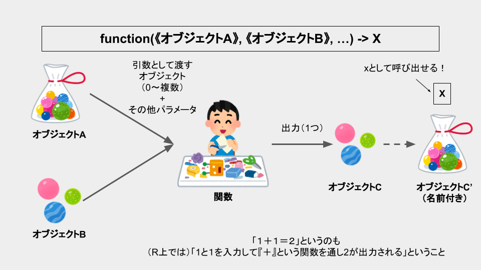

## Rを使う理由・利点

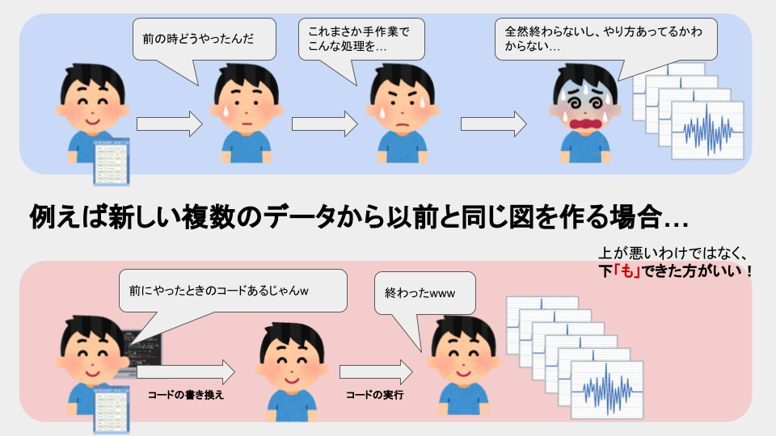


## **①繰り返し＆やり直しが楽**
#### <strong><u>作業面</strong></u>

- スクリプトをきちんと書いておけば、**コードを実行するだけで処理を何回でも行うことができる**
  - 例えば、発表で用いるすべての図を一つのスクリプトを実行するだけで再出力することが可能
- for文などを用いることにより**容易に繰り返し実行が可能**
  - 例えば、「100通りのデータそれぞれに対して回帰分析を行う」という処理も簡単に実行できる
- データが変わった場合にも同じコードで**容易に再実行が可能**
  - 例えば追加調査などでデータが増えた場合にも、データの形式が変わっていなければ同じコードで処理を行うことができる

#### <strong><u>研究面</strong></u>

- 作業効率が上がる
- 試行錯誤をしやすくなることにより、**研究手法をより最適化しやすくなる**
  - 例えば、複数の解析手法を試せるようになることで、より適した解析手法を選択できるようになる


## **②規格化を行いやすい**

#### <strong><u>作業面</strong></u>

- データの形式が同じでさえあれば、**同じコードを違うデータに一律で適用し同じ形式の結果を出力することが可能**
  - 例えば、glm関数などはデータがデータフレーム形式で与えられれば、どんなデータに対しても処理を行うことができる

#### <strong><u>研究面</strong></u>

- **研究がどの程度一般化できるかを考える端緒となる**
  - 例えば関数定義などを考える過程で、「自分が扱っているデータは他の類似データとどこが違うのか」、「自分が行おうとしている処理は他のデータに対しても適用可能か」などについても考えることになる


## **③他人に伝えるのが簡単（≒再現しやすい）**

#### <strong><u>作業面</strong></u>

- どのようなデータ処理を行ったかは、**コードを見れば一発でわかる**
- 言葉や文で「こうこうこうやる」などと伝えるより、**Rスクリプト一つを渡した方が圧倒的に楽**
  - 例えば、「どのような回帰分析を行ったか」の詳細を言葉のみで伝えることは非常に難しいが、処理そのものが記録されているスクリプトを共有すればそれを簡単に伝えることができる

#### <strong><u>研究面</strong></u>

- ***発表の際にも方法の妥当性を保証する***
  - 例えば、他の人は公開されたコードを見てデータ処理の過程を確認し、実行することで処理を再現することができる
- ***解析方法はRのコードを見ればすぐにわかる***
  - 例えば、「GLM解析を行った」の一言から尤度の算出方法や最尤推定値の算出方法等を知ることは出来ないが、`model <- glm(data = data, ...)`等のコードからはそれらの情報を含む、解析方法についての十分な情報を得ることができる


## Tidyverseとは

> The tidyverse is an opinionated collection of R packages designed for data science. All packages share an underlying design philosophy, grammar, and data structures.
> 
> https://www.tidyverse.org/　より

- Tidyverseはデータを扱うために一貫性をもって作成されたパッケージ群

- Tidyverseではデータフレームに対する操作を関数で行うことができる

  - <strong><font color="#f8b500">iris[, c("Sepal.Length", "Species")]</font> ⇔ <font color="#f8b500">select(iris, Sepal.Length, Species)</font></strong>

- 従来はデータフレームを入出力にできずに不便だった点も、Tidyverseでは解決されている

Ex. iris内における各種の観測数をカウント

```{r base}
table(iris$Species)
```

```{r tidyverse}
iris %>% count(Species)
```


## Tidyverseを使うメリット
<strong><u>素のRを使うよりも圧倒的に楽＆わかりやすい（処理が明示的）</strong></u>

Ex.列を抜き出して、条件で選択

***素のR***

```{r base_sample}
iris2 <- iris
iris2 <- iris2[, c("Sepal.Length", "Species")]
iris2 <- iris2[iris2[, "Sepal.Length"] < 5.0, ]
```

***Tidyverse***

```{r tidyverse_sample}
iris2 <- iris %>% 
select(Sepal.Length, Species) %>% 
filter(Sepal.Length < 5.0)
```

**生態学分野では多くの場合、調査で得たデータをデータフレームとしてRに読み込み、データ整形・解析・作図を行う。そのためデータフレーム志向で設計されたTidyverseは非常に使いやすく有用である（※個人的な意見です）**


## パイプについて
**（簡単に言うと）処理を横につなげられるようにするツール**

<strong><font color="#f8b500">function(x, …)</font> ⇔ <font color="#f8b500">x %>% function(...)</font></strong>

- Ex. iris %>% select(Sepal.Length) ⇔ select(iris, Sepal.Length)

本当は段階的に別名オブジェクトに格納した方がコード的には確実だけど、
<strong>実際には<u>連続で関数を適用したりするのでこっちの方が便利</u></strong>

```{r pipe}
unique(pull(filter(iris, Sepal.Length < 5.0), Sepal.Length))
iris %>% filter(Sepal.Length < 5.0) %>% pull(Sepal.Length) %>% unique() 
```

<strong>パイプによって<u>データ処理のフロー</u>を、視覚的にもわかりやすく記述することができる</strong>


## RStudioを使うメリット

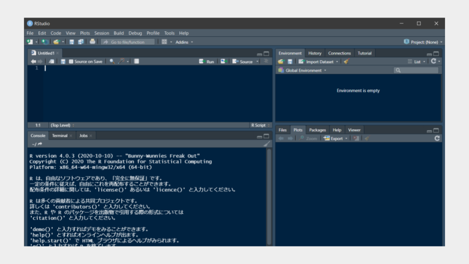

> RStudio is an integrated development environment (IDE) for R. It includes a console, syntax-highlighting editor that supports direct code execution, as well as tools for plotting, history, debugging and workspace management. 
> 
> https://www.rstudio.com/products/rstudio/#rstudio-desktop　より

#### RStudioとは

RStudioはR用の統合解析環境である。

#### RStudioとは

- スクリプト↔コンソールの行き来が楽なので、スクリプトを書きやすい
- コードに不慣れな人でも扱いやすい親切設計（色々なことがマウスクリックでもできる）なので、細かいことに煩わされずに済む
- コードの色分けやオートフィル機能等もとても便利

# <strong><font color="#007bbb">基礎編②</font>データ整形の基礎</strong>
## 準備
#### 作業ディレクトリの設定

データや出力結果を置いておくためのディレクトリ（フォルダ）を指定する。

Rstudio上では
Session > Set Working Directory > Choose Directory
で設定できる。

今回は[こちらのページ](https://github.com/saplings-ecology/2022-meetings)でCode>Download ZIPと進み、ダウンロードして解凍したフォルダを作業ディレクトリにすることで以下コードを円滑に実行できる。


#### Tidyverseの読み込み	

パッケージの読み込みは`library`関数で行う。もしTidyverseがインストールされていない場合には、`install.package("tidyverse")`でパッケージをインストールする。

```{r load}
library(tidyverse)
# インストールは
# install.package("tidyverse")
```


## 使うデータ：島嶼における木本植物の種多様性に関するデータ

今回は以下のデータペーパーで提供されているデータを例として使用する。

> Schrader, J., Moeljono, S., Tambing, J., Sattler, C., & Kreft, H. 2020. A new dataset on plant occurrences on small islands, including species abundances and functional traits across different spatial scales. Biodiversity Data Journal 8:.
> 
> URL: https://bdj.pensoft.net/article/55275/instance/5664007/
> 
> Use license: Creative Commons Public Domain Waiver (CC-Zero)


インドネシアのRaja Ampat諸島に位置する60の小規模な島における木本植物のデータセット。
各島に2x2mのプロットからなるトランセクトを島の大きさに応じて設置し、プロット内に根を張る胸高直径2㎝以上のすべての種を記録したデータである。
その他に、島についての詳細データや植物種の機能的特性のデータ、種名のリスト、GBIF上に記録されている種の出現記録のデータが付属している。

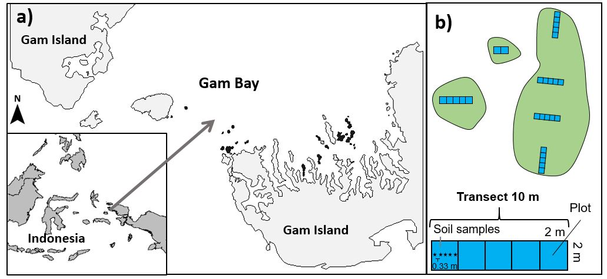

> Schrader et al. (2020)　より

各データは以下のファイルに格納されている（元データを微調整し、CSV形式で保存したもの）：

- **Community_data.csv（プロット内の出現種のデータ）**
- **Island_data.csv（島の詳細データ）**
- **Plant_functional_trait_data.csv（植物の機能的特性データ）**
- **Species_data.csv（種名リスト）**
- **Plant_occeurences.csv（GBIF上の観察記録）**


調査、データの詳細については詳しくは[リンク先](https://bdj.pensoft.net/article/55275/list/18/)を参照のこと。


**以下の項目名に示されている関数名にはレファレンスページへのリンクを貼ってあります。それぞれの関数を使う際には、ぜひ一度見てみてください（Rから呼び出せる関数ヘルプと同じ内容です）。**

## データの読み込み　[***read_csv***](https://readr.tidyverse.org/reference/read_delim.html)
`read_scv`関数は`read.csv`関数とほぼ同等の関数であり、目的とするCSVファイル（やその他の形式のテキストファイル）のパスを渡すとデータの読み込みを行ってくれる。ただし、この際に読み込まれたデータはTibble形式で格納されることに注意。

※d<u>ata.frameとtibbleは厳密には違いますが、この資料ではわかりやすさのために両方とも「データフレーム」と呼んで区別していません。</u>

```{r read_csv1, message = FALSE}
community <- read_csv("data/Community_data.csv")
island <- read_csv("data/Island_Data.csv")
trait <- read_csv("data/Plant_functional_trait_data.csv")
occurence <- read_csv("data/Plant_occurrences.csv")
species <- read_csv("data/Species_data.csv")
```

読み込んだデータの中身は以下のようになっている：
```{r read_csv2}
community
colnames(community)

island
colnames(island)

trait
colnames(trait)

occurence
colnames(occurence)

species
colnames(species)
```


## データ整形をする前に

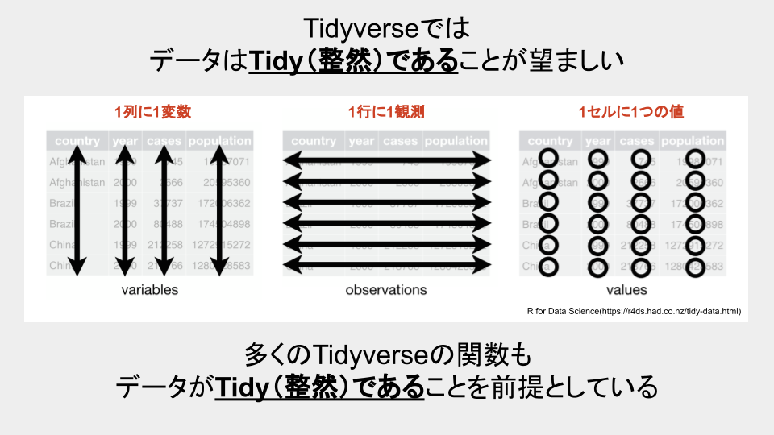

整然データについて詳しくは[こちらのページ](https://r4ds.had.co.nz/tidy-data.html)を参照のこと。

- Tidyverseによるデータ整形では、<strong>ほとんどの関数が<u>列名を引数（関数に与える値）としてとる</u></strong>
- つまり、<strong><font color="#ee827c">「どの変数に対して何をしたいか」</font></strong>をはっきりさせておくことが大事
  - **変数Aと変数Bの大小を比べたい！**
  - **変数Aを抜き出したい！**
  - **変数Aに関数を適用したい！**


## 列の選択　[***select***](https://dplyr.tidyverse.org/reference/select.html)
`select`はデータフレームから特定の列を抜き出すために用いる関数である。この際、抜き出された列がたとえ一列だったとしてもデータフレームとして出力される。ベクトルとして抜き出したいのであれば、後述する`pull`を用いる

```{r select}
community %>% 
select(island_ID, transect_ID, plot_ID, species_ID)

community %>% 
select(-DBH_cm, -tree_height_m)
```


## 条件による行の選択　[***filter***](https://dplyr.tidyverse.org/reference/filter.html)
各列の値に基づく条件を用いて行を選択したい場合には`filter`関数を用いる。素のRで行う場合にはこの処理の記述は非常に煩雑になるため、`filter`関数は積極的に使っていきたい。

```{r filter}
community %>% 
filter((island_ID == "GB7")&(transect_ID == "GB7_T1")&(plot_ID == "GB7_T1_ST2"))
```


## ベクトルの抜き出し　[***pull***](https://dplyr.tidyverse.org/reference/pull.html)　新しい列に計算結果を格納　[***mutate***](https://dplyr.tidyverse.org/reference/mutate.html)　文字列に対する操作　[***str_関数***](https://stringr.tidyverse.org/reference/index.html)
データフレーム中の列をベクトルとして抜き出したい場合には`pull`を用いる。
データフレームに、新たなデータを含む新たな列を追加したい場合には`mutate`を用いる。多くの場合、既存の列の値をもとに新たな値を算出し、その値を格納する処理に用いられる。
`str_`関数はパッケージ`stringr`に含まれる関数であり、ここで用いている`str_extract`は与えられた文字列から特定パターン（正規表現も可能）と一致する部分を抜き出してくれる関数である。

```{r pull_mutate_str}
occurence %>% pull(scientificName) -> occurence_scientificName
occurence_scientificName[1:10]

occurence2 <- occurence %>% 
  mutate(species_name = str_extract(scientificName, pattern = "^[A-Za-z]+ [A-Za-z]+"))

occurence2 %>% pull(species_name) -> occurence2_scientificName
occurence2_scientificName[1:10]
```


## 列を分割　[***separate***](https://tidyr.tidyverse.org/reference/separate.html)　日付の定義　[***lubridate::ymd***](https://lubridate.tidyverse.org/reference/ymd.html)
`separate`は特定列に含まれる文字列を、特定文字列を基準に分割し、2列に分けて格納する。`ymd`は日付を扱うためのパッケージ`lubridate`に含まれる関数であり、「Year-Month-Day」形式で文字列として格納されている日付をDate型に変換してくれる。ここで用いている`[パッケージ名]::[関数]`という記法は特定のパッケージから1つだけ関数を呼び出したいときに便利。

```{r separate_ymd}
occurence3 <- occurence2 %>% 
  separate(eventDate, sep = "/", into = c("Date1", "Date2")) %>% 
  mutate(
    Date1 = lubridate::ymd(Date1), 
    Date2 = lubridate::ymd(Date2)
  )
```


## 観測数のカウント　[***count***](https://dplyr.tidyverse.org/reference/count.html)
`count`関数は与えられた列内に含まれる各要素の観測数（＝データフレーム内での行数）を数え、データフレーム形式で出力してくれる。2つ以上の列名を与えた場合には、各要素の組み合わせそれぞれの観測数を数えてくれる。
同様の処理は`group_by`と`tally`を組み合わせることでも行うことができる。

```{r count}
community %>% 
  count(island_ID, species_ID)
```


## グループ化　[***group_by***](https://dplyr.tidyverse.org/reference/group_by.html)　と　集計　[***summerise***](https://dplyr.tidyverse.org/reference/summarise.html)
`group_by`は与えられた列の要素に基づいてデータフレーム内の行をグループ化する関数である。`summarise`は各グループに含まれるデータに対し関数を適用することで値を要約し、結果をデータフレームとして返す。

```{r group_by_summarise}
community %>% 
  group_by(species_ID) %>% 
  summarise(
    mean_DBH = mean(DBH_cm), 
    mean_height = mean(tree_height_m)
  )

```


## データフレームの結合　[***full_join***](https://dplyr.tidyverse.org/reference/mutate-joins.html)
`full_join`は`by`で与えられた列をキーとして2つのデータフレームを結合する関数である。`full_join`は2つのデータフレームのキー列に含まれるすべての要素を含む（つまりデータフレームAとBを`full_join`で結合した場合、データフレームAに記録がない要素についての行ではデータフレームAに含まれていた列の値がすべてNAとなる）。

このように、`full_join`による結合ではデータフレームの行数が気付かぬうちに増えてしまう危険性がある。そのため、適宜左側結合の`left_join`、右側結合の`right_join`等と使い分けるべきである。

```{r full_join}
species

trait

full_join(species, trait, by = c("species_ID" = "species_ID"))
```


## 縦長変換　[***pivot_longer***](https://tidyr.tidyverse.org/reference/pivot_longer.html)：列名と各列の値をそれぞれ一列に
`pivot_longer`はデータフレームを縦長変換するための関数であり、与えられた列の列名を一つの列に、各列の値をもう一つの列に格納する。特に読み込んだデータフレームが非Tidyな場合（例えば、各列に各月の値が入っている場合など）に、それらをTidyなデータに変換するために用いることができる。

```{r pivot_longer}
island_pivot1 <- island %>% 
  select(island_ID, island_coordinates, island_area, island_perimeter)
island_pivot2 <- island_pivot1 %>% 
  pivot_longer(cols = c(island_area, island_perimeter), names_to = "Island_property", values_to = "Value")
island_pivot2
```


## 横長変換　[***pivot_wider***](https://tidyr.tidyverse.org/reference/pivot_wider.html)：列内の要素を列名に
`pivot_wider`はデータフレームの横長変換を行うための関数であり、一つの列に含まれる要素を列名、もう一つの列に含まれる値を各列の値として引き出しデータフレームを横長に展開する。横長変換する際にはデータが存在しないセルも生じるが、その際にはそのセルの値はNAとなる。

`pivot_longer`の逆にあたる処理を行う関数。

```{r pivot_wider}
island_pivot3 <- island_pivot2 %>% 
  pivot_wider(names_from = "Island_property", values_from = "Value")
island_pivot3
```


## データフレームの書き出し　[***write_csv***](https://readr.tidyverse.org/reference/write_delim.html)
`write_csv`は`write.csv`とほぼ同等の関数で、データフレームを指定されたファイル名のテキストファイル（CSV含む）に出力する。デフォルトのエンコーディングはUTF-8であるため、日本語が含まれる場合は注意。

```{r write_csv}
write_csv(occurence3, file = "occurence3.csv")
```


# <strong><font color="#007bbb">基礎編③</font>データ整形の実践</strong>
#### 以下のデータを得る方法を考えてみよう！
ここまで見て来たTidyverseの関数を使って以下のような実践的な処理をどのように行うことができるか、考えてみよう。

紹介していない関数も使うので、適宜検索しながら進めよう。

- ***種ごとのDBHの平均と標準誤差、種ごとの樹高の平均と標準誤差と種のデータ（species、trait）を結合したデータフレームを作成する***

- ***島ごとの総出現種数、総出現属数、総出現科数と島のデータを結合したデータフレームを作成する***

- ***調査プロット名×種名行列（＝PCAやDCAで使える形）を作成する***

答えを見る前に考えてみてね

## 種ごとのDBHの平均と標準誤差、種ごとの樹高の平均と標準誤差と種のデータ（species、trait）を結合したデータフレームを作成する

`group_by`と`summarise`を用いて、各種ごとに平均値に加えて標準誤差を算出する。得られたデータフレームを`species_ID`をキーとして`species`、`trait`と`full_join`する。

```{r lesson1}
community %>% 
  group_by(species_ID) %>% 
  summarise(
    mean_DBH = mean(DBH_cm), 
    se_DBH = sd(DBH_cm)/sqrt(length(DBH_cm)), 
    mean_height = mean(tree_height_m), 
    se_height = sd(tree_height_m)/sqrt(length(tree_height_m))
  ) -> species_dbh_height

species_perperty <- full_join(species, trait, by = "species_ID") %>% full_join(species_dbh_height, by = "species_ID")

species_perperty
```


## 島ごとの総出現種数、総出現属数、総出現科数と島のデータを結合したデータフレームを作成する

以下のように`select`、[`distinct`](https://dplyr.tidyverse.org/reference/distinct.html)、`count`を組み合わせることで、各島に存在する木本植物の種数、属数、科数を算出し、最後に`island_ID`をキーに結合する。
属数に関しては、`str_extract`で種名から属名を抽出し、それを参照してカウントする。

**ただし、60島のデータを含む`island`とそのうちの40島における調査データをもとに作成したデータフレームを`full_join`で結合しているため、`island_property`には`n_species`等の列の値がNAになっている20行のデータが含まれることになる点には注意。**

```{r lesson2}
community_species <- left_join(community, species, by = "species_ID")

sp_per_island <- community_species %>% 
  select(island_ID, species_ID) %>% 
  distinct() %>% 
  count(island_ID, name = "n_species")
sp_per_island

genera_per_island <- community_species %>% 
  mutate(Genera = str_extract(Species, pattern = "[A-Za-z]+")) %>% 
  select(island_ID, Genera) %>% 
  distinct() %>% 
  count(island_ID, name = "n_genera")
genera_per_island

family_per_island <- community_species %>% 
  count(island_ID, Family) %>% 
  select(island_ID, Family) %>% 
  distinct() %>% 
  count(island_ID, name = "n_family")
family_per_island

island_property <- full_join(island, sp_per_island, by = "island_ID") %>% 
  full_join(genera_per_island, by = "island_ID") %>% 
  full_join(family_per_island, by = "island_ID")
island_property
```


## 調査プロット名×種名行列（＝PCAやDCAで使える形）を作成する

`count`で調査プロット×植物種のクロス集計を行い、得られたデータフレームを`pivot_wider`で横長返還してから`as.matrix`で行列に変換する。
その際、`pivot_wider`を行って生成されたNAは[`mutate_all`](https://dplyr.tidyverse.org/reference/mutate_all.html)と[`replace_na`](https://tidyr.tidyverse.org/reference/replace_na.html)で0に置換し、列として格納されていた`plot_ID`は[`column_to_rownames`](https://tibble.tidyverse.org/reference/rownames.html)で行名に移動する。

```{r lesson3}
community %>% 
  count(plot_ID, species_ID) %>% 
  pivot_wider(names_from = species_ID, values_from = n) %>% 
  mutate_all(replace_na, 0) %>% 
  column_to_rownames("plot_ID") %>% 
  as.matrix() -> species_matrix
species_matrix[1:10, 1:10]
```


# <strong><font color="#007bbb">基礎編④</font>ggplot2を利用した作図の基礎</strong>
## ggplot2を使うメリット
***楽＆わかりやすい（レイヤーが明示的）＆やり直しやすい***

#### Ex.plotしてPNGに保存
##### **素のR：ベクトル志向**
  ```{r base_plot}
  plot(iris$Sepal.Length, iris$Sepal.Width)
  
  # PNGで保存
  png("iris_scatterplot.png", width = 480, height = 480)
  plot(iris$Sepal.Length, iris$Sepal.Width)
  dev.off()
  ```

##### **ggplot2：データフレーム志向**
  ```{r ggplot_plot}
  g <- ggplot() + 
  			geom_point(data = iris, aes(x = Sepal.Length, y = Sepal.Width, color = Species))
  plot(g)
  
  # PNGで保存
  ggsave(g, file = "iris_scatterggplot.png", width = 7, height = 7)
  ```
  
## ggplot2の仕組みの超簡単な説明
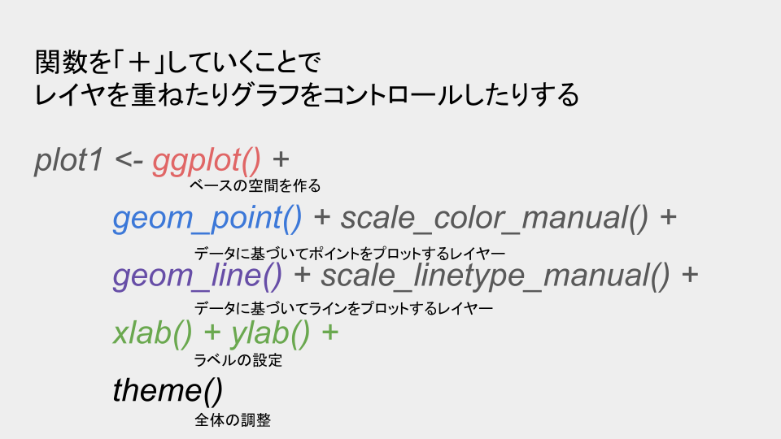


## 散布図　[***geom_point***](https://ggplot2.tidyverse.org/reference/geom_point.html)：とりあえずプロット

ggplot2における作図は`ggplot`関数で元レイヤを作り、`geom_*`関数でデータをマッピングするところから始まる。
使う機会が非常に多いであろう`geom_point`関数は与えられたデータを元に点をプロットする。

**先に述べたように、`island_property`の60行中20行では`n_species`の値がNAとなっている。よって、描画時にはこれらの値は描画されず、`Removed 20 rows containing missing values (geom_point).`という警告が出ることになる。**

```{r geom_point1}
ggplot(data = island_property) + 
  geom_point(aes(x = island_area, y = n_species))

g_point <- ggplot(data = island_property) + 
  geom_point(aes(x = island_area, y = n_species))

ggsave(g_point, file = "g_point.png")
```
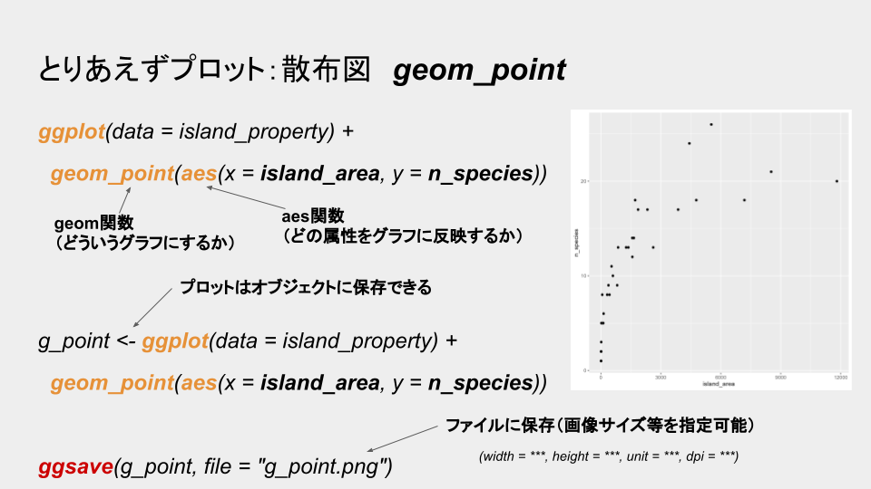


## 散布図　[***geom_point***](https://ggplot2.tidyverse.org/reference/geom_point.html)：レイヤの重ね合わせ

`geom_*`関数による各プロットは、レイヤとして重ね合わせることができる。

```{r geom_point2}
ggplot(data = island_property) + 
  geom_point(aes(x = island_area, y = n_species), color = "steelblue")

ggplot(data = island_property) + 
  geom_point(aes(x = island_area, y = n_genera), color = "lightcoral")

ggplot(data = island_property) + 
  geom_point(aes(x = island_area, y = n_family), color = "forestgreen")

ggplot(data = island_property) + 
  geom_point(aes(x = island_area, y = n_species), color = "steelblue") + 
  geom_point(aes(x = island_area, y = n_genera), color = "lightcoral") + 
  geom_point(aes(x = island_area, y = n_family), color = "forestgreen")
```


## 散布図　[***geom_point***](https://ggplot2.tidyverse.org/reference/geom_point.html)：とりあえず色分け

`geom_point`に渡す`aes`関数内で`color = <列名>`を指定することにより、その列に含まれる値に基づいてプロット上の点の色分けを行うことができる。列に含まれる値が文字列やfactor含む離散値だった場合には色「分け」され、連続値だった場合には数値に応じたグラデーションによる描き分けがなされる。

※ここでは例示のため`island_property2`を描画しているが、縦に3つ並ぶ値はすべて同じ島についてのものであることに注意。<u>本来であればきちんとした整然データを描画することが望ましい</u>（のだけれど、良い感じのカテゴリ値がなかったのでご容赦を）。

```{r geom_point3}
island_property2 <- island_property %>% 
  pivot_longer(cols = c(n_species, n_genera, n_family), names_to = "hierarchy", values_to = "value")

ggplot(data = island_property2) + 
  geom_point(aes(x = island_area, y = value, color = hierarchy)) + 
  scale_color_manual(values = c("forestgreen", "lightcoral", "steelblue"))
```

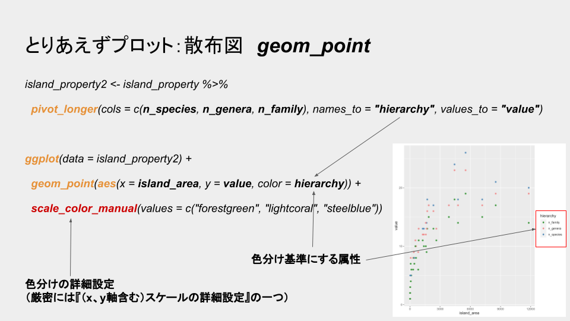


## ヒストグラム　[***geom_histogram***](https://ggplot2.tidyverse.org/reference/geom_histogram.html)

ヒストグラムの描画は`geom_histogram`で行う。`aes`にはx軸として指定したい列を与える。階級幅は、`binwidth`や`breaks`等のパラメータで設定する。

```{r geom_histogram}
ggplot(data = community) + 
  geom_histogram(aes(x = tree_height_m), breaks = seq(0, 18, 1))
```


## 箱ひげ図　[***geom_boxplot***](https://ggplot2.tidyverse.org/reference/geom_boxplot.html)

箱ひげ図の描画は`geom_boxplot`で行う。

```{r geom_boxplot}
ggplot(data = community) + 
  geom_boxplot(aes(x = island_ID, y = tree_height_m))
```


## 棒グラフ　[***geom_bar***](https://ggplot2.tidyverse.org/reference/geom_bar.html)

棒グラフの描画には`geom_bar`を用いる。y軸の値をデータフレーム内から参照する場合には`stat = "identity"`を、x軸とした値それぞれの観測数にする場合には`stat = "count"`を指定する。また、積み上げ棒グラフにしたい場合には`aes`内で`fill = <分けたい要素が格納された列名>`を指定する。割合を示したい際には、`position = "fill"`を指定する。

```{r geom_bar}
ggplot(data = community_species) + 
  geom_bar(aes(x = island_ID, fill = Family), stat = "count")
```


## 色々な微調整

`scale_*`関数を用いることで、x軸やy軸の目盛設定や軸ラベル設定、色分けの詳細設定などを行うことができる。

```{r other_settings}
ggplot(data = island_property2) + 
  geom_point(aes(x = island_area, y = value, color = hierarchy, shape = hierarchy), alpha = 0.7) + 
  scale_x_continuous(breaks = seq(0, 12000, by = 2000)) + 
  scale_y_continuous(breaks = seq(0, 30, by = 10)) + 
  scale_color_manual(name = "Classification level", values = c("forestgreen", "lightcoral", "steelblue"), labels = c("Family", "Genera", "Species")) + 
  scale_shape_discrete(name = "Classification level", labels = c("Family", "Genera", "Species")) + 
  xlab("Island area") + 
  ylab("Number of taxa")
```

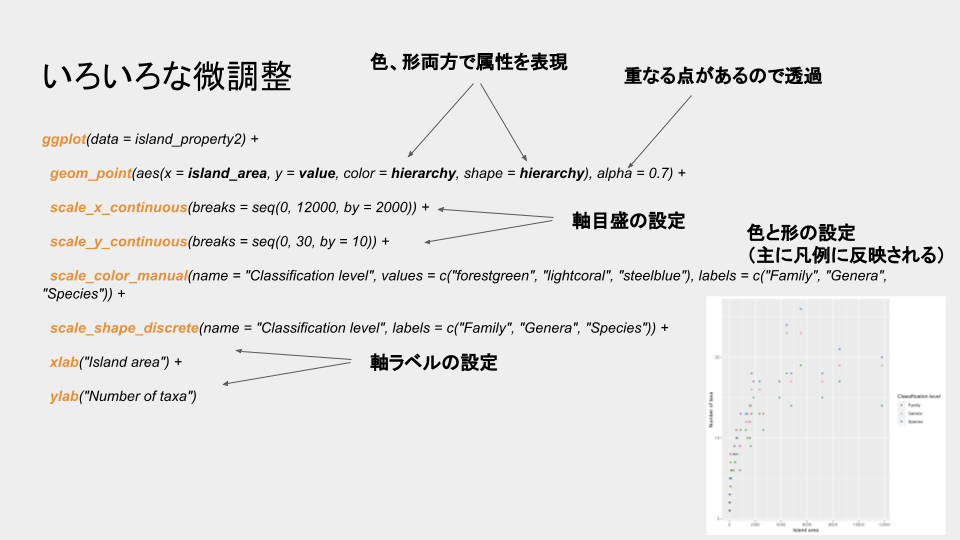


## レイアウトの調整　[***theme***](https://ggplot2.tidyverse.org/reference/theme.html)

`geom_`関数で描画を行い、`scale_`関数で色分け等の微調整を行ったとしても、最終的にPNG形式等で出力した図の体裁が整うわけではない。
パネル領域の背景、軸ラベルの文字、凡例の位置等の「見た目上の調整」は`theme`関数内で行う必要がある。
ここで注意しなければならないのが「文字や点の大きさ」であり、これらは出力画像サイズを決定してから調整することをおすすめする。

```{r theme1}
g_point_color2_theme <- ggplot(data = island_property2) + 
  geom_point(aes(x = island_area, y = value, color = hierarchy, shape = hierarchy), size = 6, alpha = 0.7) + 
  scale_x_continuous(breaks = seq(0, 12000, by = 2000)) + 
  scale_y_continuous(breaks = seq(0, 30, by = 10)) + 
  scale_color_manual(name = "Classification level", values = c("forestgreen", "lightcoral", "steelblue"), labels = c("Family", "Genera", "Species")) + 
  scale_shape_discrete(name = "Classification level", labels = c("Family", "Genera", "Species")) + 
  xlab("Island area") + 
  ylab("Number of taxa") + 
  theme(
    text = element_text(family = "sans"), 
    axis.title = element_text(size = 30, color = "black"), 
    axis.text = element_text(size = 30, color = "black"), 
    axis.line = element_line(color = "black"), 
    axis.ticks.x = element_line(color = "black"), 
    axis.ticks.length.x = unit(0.3, "cm"), 
    axis.ticks.y = element_line(color = "black"), 
    axis.ticks.length.y = unit(0.3, "cm"), 
    panel.border = element_rect(fill = NA, color = "black"), 
    plot.margin = margin(2, 2, 2, 2, "cm"), 
    legend.background = element_blank(), 
    legend.position = c(0.80, 0.15), 
    legend.title = element_text(size = 30), 
    legend.text = element_text(size = 30), 
    legend.box.background = element_blank()
  )

ggsave(g_point_color2_theme, file = "g_point_color2_theme.png", width = 14, height = 14, dpi = 200)
```

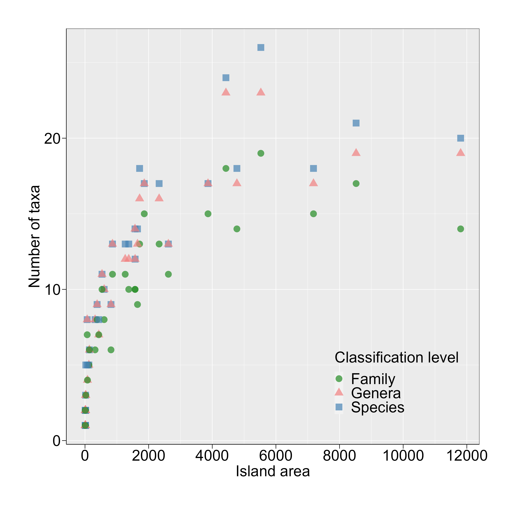


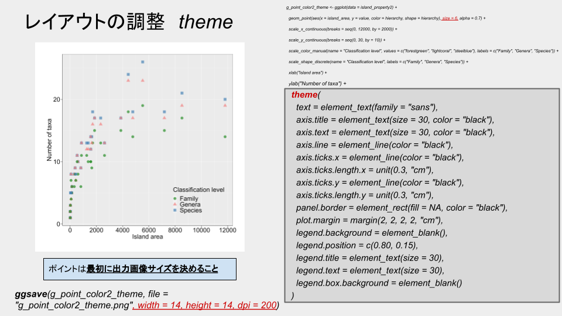


## themeは他データのプロットでも同じものを使うことができる

`theme`設定は出力画像サイズがほぼ変わらないのであれば、そのまま他のプロットでも使い回すことができる。これにより、複数の図のレイアウトに統一性を持たせることができる。

```{r theme2}
g_hist_theme <- ggplot(data = community) + 
  geom_histogram(aes(x = tree_height_m), breaks = seq(0, 18, 1), fill = "forestgreen") + 
  theme(
    text = element_text(family = "sans"), 
    axis.title = element_text(size = 30, color = "black"), 
    axis.text = element_text(size = 30, color = "black"), 
    axis.line = element_line(color = "black"), 
    axis.ticks.x = element_line(color = "black"), 
    axis.ticks.length.x = unit(0.3, "cm"), 
    axis.ticks.y = element_line(color = "black"), 
    axis.ticks.length.y = unit(0.3, "cm"), 
    panel.border = element_rect(fill = NA, color = "black"), 
    plot.margin = margin(2, 2, 2, 2, "cm"), 
    legend.background = element_blank(), 
    legend.position = c(0.80, 0.15), 
    legend.title = element_text(size = 30), 
    legend.text = element_text(size = 30), 
    legend.box.background = element_blank()
  )

ggsave(g_hist_theme, file = "g_hist_theme.png", width = 14, height = 14, dpi = 200)
```
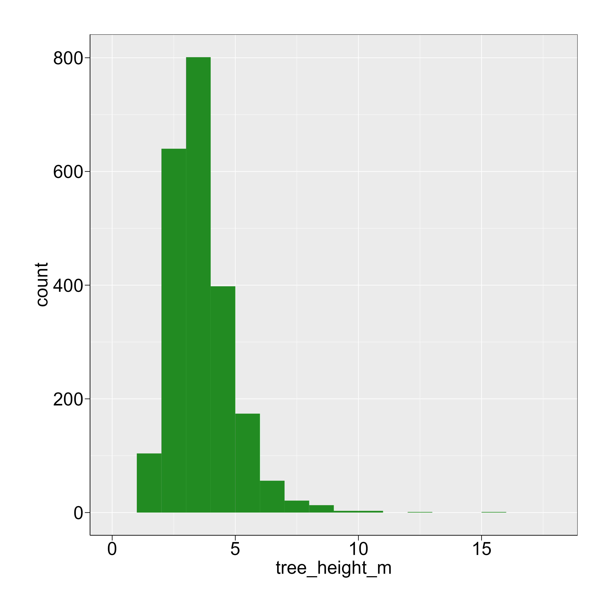


## themeはオブジェクトとして保存して呼び出すことができる&その都度上書きできる

`theme`設定はオブジェクトとして保存して呼び出すことができる。またすでに`theme`で定義されている要素に関しても、あとから`theme`で上書き再設定を行うことができる。

```{r theme3}
theme_example <- theme(
    text = element_text(family = "sans"), 
    axis.title = element_text(size = 30, color = "black"), 
    axis.text = element_text(size = 30, color = "black"), 
    axis.line = element_line(color = "black"), 
    axis.ticks.x = element_line(color = "black"), 
    axis.ticks.length.x = unit(0.3, "cm"), 
    axis.ticks.y = element_line(color = "black"), 
    axis.ticks.length.y = unit(0.3, "cm"), 
    panel.border = element_rect(fill = NA, color = "black"), 
    plot.margin = margin(2, 2, 2, 2, "cm"), 
    legend.background = element_blank(), 
    legend.position = c(0.80, 0.15), 
    legend.title = element_text(size = 30), 
    legend.text = element_text(size = 30), 
    legend.box.background = element_blank()
  )

g_hist_theme_overwrite <- ggplot(data = community) + 
  geom_histogram(aes(x = tree_height_m), breaks = seq(0, 18, 1), fill = "forestgreen") + 
  theme_example + 
  theme(
    panel.background = element_blank(), 
    panel.grid.major = element_line(color = "black", linetype = 2)
  )

ggsave(g_hist_theme_overwrite, file = "g_hist_theme_overwrite.png", width = 14, height = 14, dpi = 200)
```

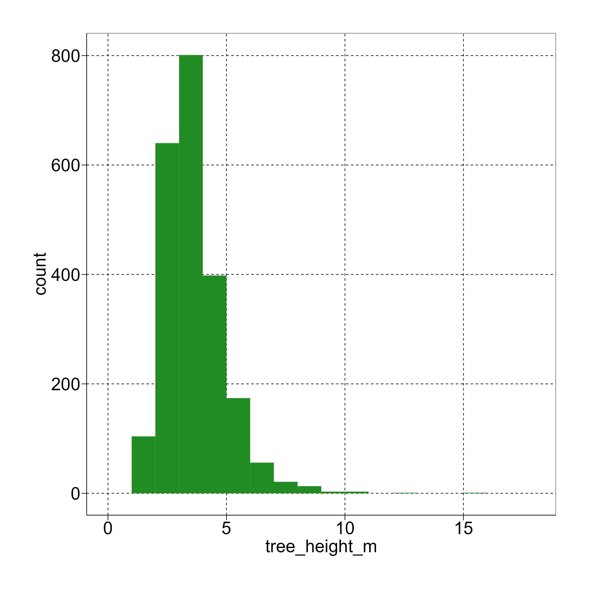

```{r}
g_community_species <- ggplot(data = community_species) + 
  geom_bar(aes(x = island_ID, fill = Family), stat = "count") + 
  xlab("Island ID") + 
  ylab("Number of observations") + 
  theme_example + 
  theme(
    axis.text.x = element_text(angle = -45, hjust = 0), 
    legend.position = c(0.82, 0.70)
  )

ggsave(g_community_species, file = "g_community_species.png", width = 24, height = 14, dpi = 200)
```

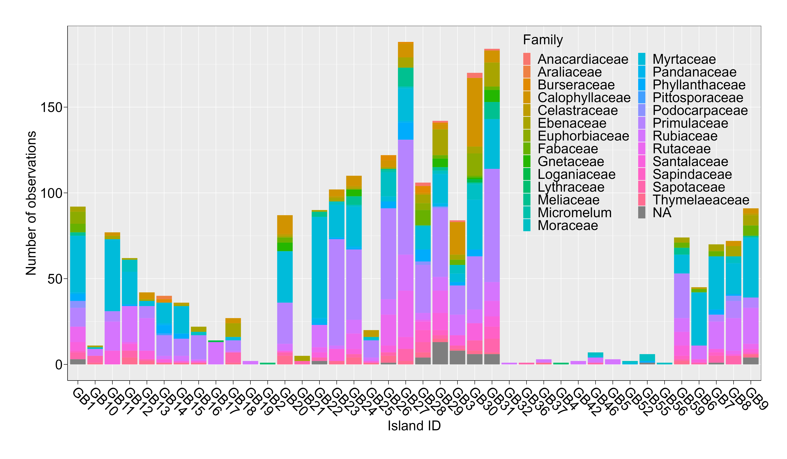


## 応用：樹高とDBHを種ごとにプロットし、科で色分け

`species_property`に含まれるデータをもとに、各種の平均DBHと平均樹高をプロットし、科名で色分けする。ここではそれに加えて、`geom_segment`を用いて標準誤差をもとに95%信頼区間も表示している。

```{r ggplot_lesson}
g_dbh_and_height <- ggplot(data = species_perperty) + 
  geom_point(aes(x = mean_DBH, y = mean_height, color = Family), size = 4) + 
  geom_segment(aes(x = mean_DBH, xend = mean_DBH, y = mean_height - 1.96*se_height, yend = mean_height + 1.96*se_height, color = Family)) + 
  geom_segment(aes(x = mean_DBH - 1.96*se_DBH, xend = mean_DBH + 1.96*se_DBH, y = mean_height, yend = mean_height, color = Family)) + 
  scale_x_continuous(name = "Average DBH (cm)", limits = c(0, 25)) + 
  scale_y_continuous(name = "Average height (m)", limits = c(0, 15)) + 
  scale_color_discrete(name = "Family of speceis") + 
  coord_cartesian(expand = FALSE) + 
  theme_example + 
  theme(
    legend.position = c(0.80, 0.20), 
    legend.text = element_text(size = 15)
  )

ggsave(g_dbh_and_height, file = "g_dbh_and_height.png", width = 14, height = 14, dpi = 200)
```

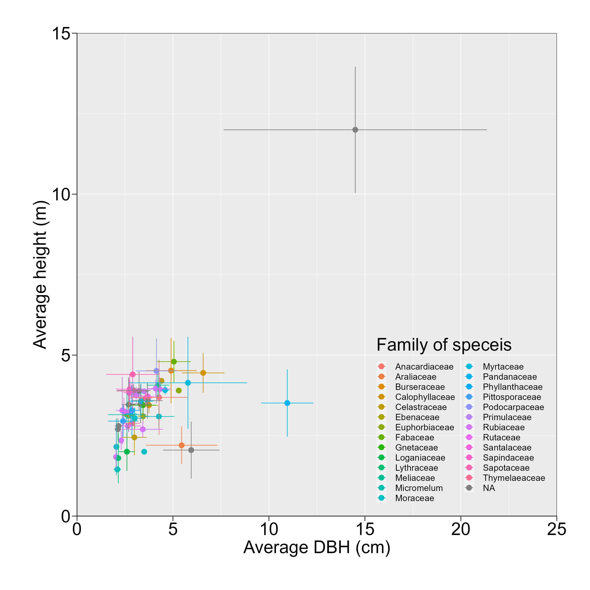


# <strong><font color="#ee827c">発展編①</font>複数グループに対して同様の処理を行う（[nest](https://tidyr.tidyverse.org/reference/nest.html)→[map](https://purrr.tidyverse.org/reference/map.html)による反復処理）</strong>

## 複雑な処理の繰り返し適用
- 大きなデータを解析していると複数の同形式のデータについて同様の処理を適用したいケースが出てくる

- 具体的には、<strong><u>地点ごとに生物多様性指数を算出したい</strong></u>、<strong><u>種ごとのデータに対して回帰分析を行いたい</strong></u>場合などが考えられる

- 「基礎編」で扱ったグループごとに平均値を算出するような場合はいいが、処理が複雑になった場合にも対処できる方法を知らないと、<u>同じコードを何回もコピペしてそれぞれを訂正するという非常に危ないコーディングを行うことになる</u>


## Tidyverseを利用した繰り返し処理
Ｒの基本パッケージを用いる場合、リスト化したデータとlapplyを用いることなどが方法の一つである

```{r lapply}
iris_sp <- list(Set = iris[iris$Species == "setosa", ], ver = iris[iris$Species == "versicolor", ], vir = iris[iris$Species == "virginica", ])
correlation_sp <- lapply(iris_sp, function(x) cor.test(x$Sepal.Length, x$Sepal.Width, method = "pearson"))
correlation_sp[[1]]
```


Tidyverseでは[tidyr::nest](https://tidyr.tidyverse.org/reference/nest.html)と[purrr::map](https://purrr.tidyverse.org/reference/map.html)を用いることでより簡単に、明示的に同様の処理を行い、結果をそのままデータフレーム（Tibble）に格納することができる。

```{r map}
iris %>% 
　　  group_by(Species) %>% 
 　　 nest() %>% 
  　　mutate(correlation_sp = map(data, function(x) cor.test(x$Sepal.Length, x$Sepal.Width, method = "pearson")))
```


## nest→mapの仕組み
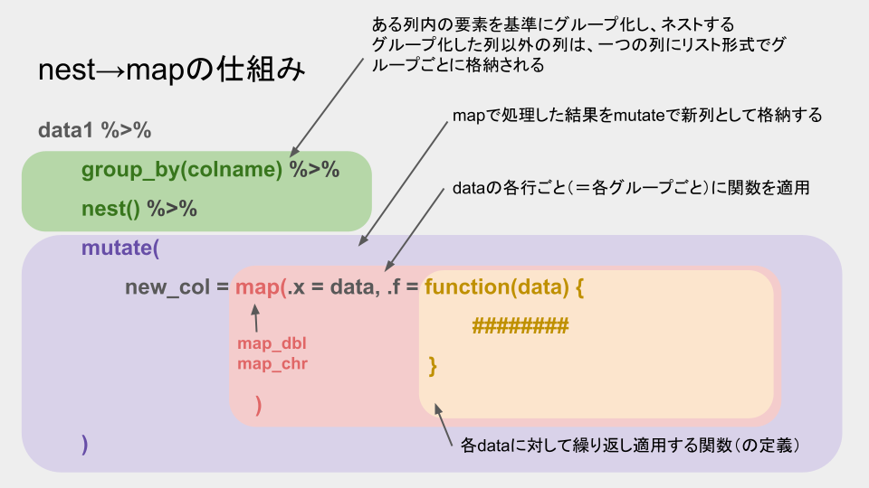


## 例題：島ごとに各種の観測数を算出

今回のデータで島ごとに各種の観測数を集計したい場合には次のような方法が考えられる。ここで島ごとのリストは`data2`の各行の値として格納されている。

```{r count_per_island}
community %>% 
  group_by(island_ID) %>% 
  nest() %>% 
  mutate(
    data2 = map(data, function(data) {
      					count_of_species <- data %>% 
        						group_by(species_ID) %>% 
        						tally()
      					return(count_of_species)
    				}
)
  ) -> sp_count_per_island

sp_count_per_island

sp_count_per_island[9, 3] %>% unnest()
```

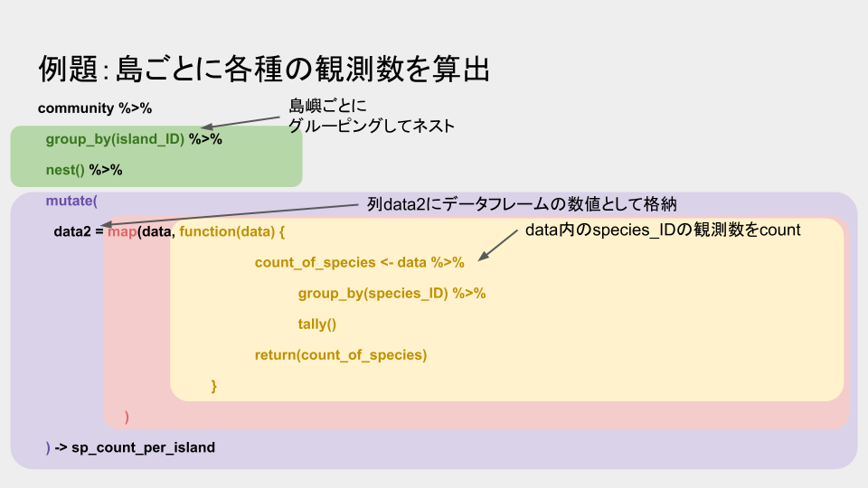


## 例題：島あたりのα多様性指数（Shannons’ H）の算出

島ごとに各種の観測数を算出してしまえば、それをもとに多様性の指標である[Shannon's H](https://en.wikipedia.org/wiki/Diversity_index#Shannon_index)を算出することができる。
ここでは種iの観測数を島内における全種の観測数で除したものをpiとして便宜的に用いている。


※「H’」の表記もありうるが、これも便宜的に（コードを書く都合上）「H」としている。

```{r diversity_per_island}
sp_count_per_island %>% 
mutate(
    Shannon_H = map_dbl(data2, function(data2){
      						　　　percentage <- data2$n / sum(data2$n)
      						　　　H = - sum(sapply(percentage, function(x) {x * log(x)}))
     	 					　　　return(H)
    							}
)
  ) -> diversity_per_island

diversity_per_island
```

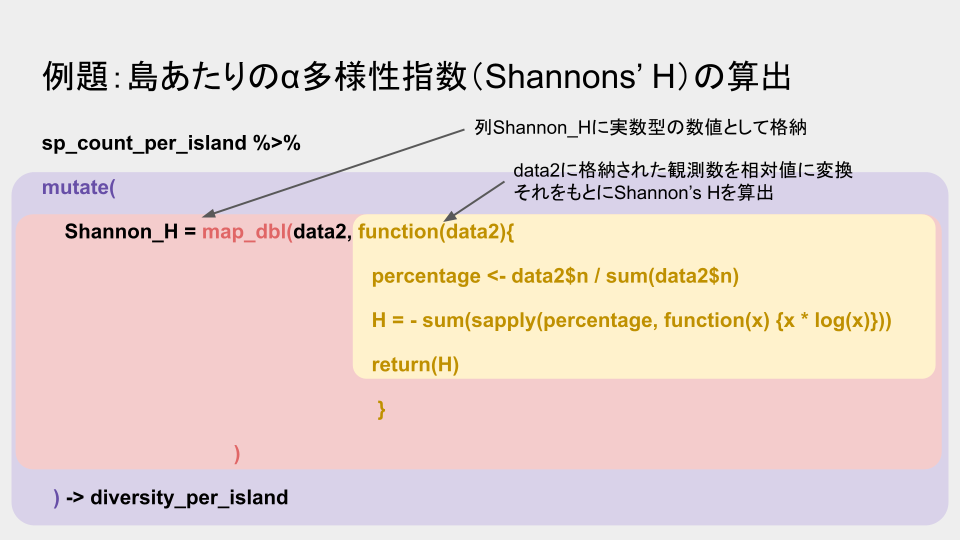


## 結果の描画

```{r map_plot}
island_diversity <- full_join(sp_per_island, diversity_per_island, by = "island_ID") %>% full_join(island, by = "island_ID") 

g_area_diversity <- ggplot(data = island_diversity) + 
  geom_point(aes(x = island_area, y = Shannon_H), size = 6, alpha = 0.5) + 
  scale_x_continuous(name = "Island area", breaks = seq(0, 12000, by = 2000)) + 
  scale_y_continuous(name = "Shannon's H", breaks = seq(0, 3, by = 1)) + 
  theme_example
ggsave(g_area_diversity, file = "g_area_diversity.png", width = 14, height = 14, dpi = 200)

g_distance_diversity <- ggplot(data = island_diversity) + 
  geom_point(aes(x = distance_Gam, y = Shannon_H), size = 6, alpha = 0.5) + 
  scale_x_continuous(name = "Shortest distance of each island to the nearest large landmass", breaks = seq(0, 1400, by = 200)) + 
  scale_y_continuous(name = "Shannon's H", breaks = seq(0, 3, by = 1)) + 
  theme_example
ggsave(g_distance_diversity, file = "g_distance_diversity.png", width = 14, height = 14, dpi = 200)
```
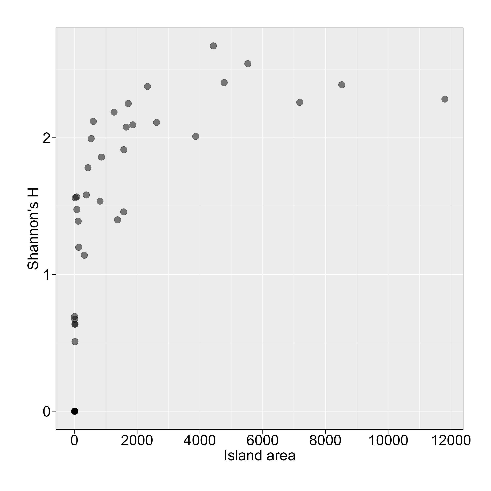
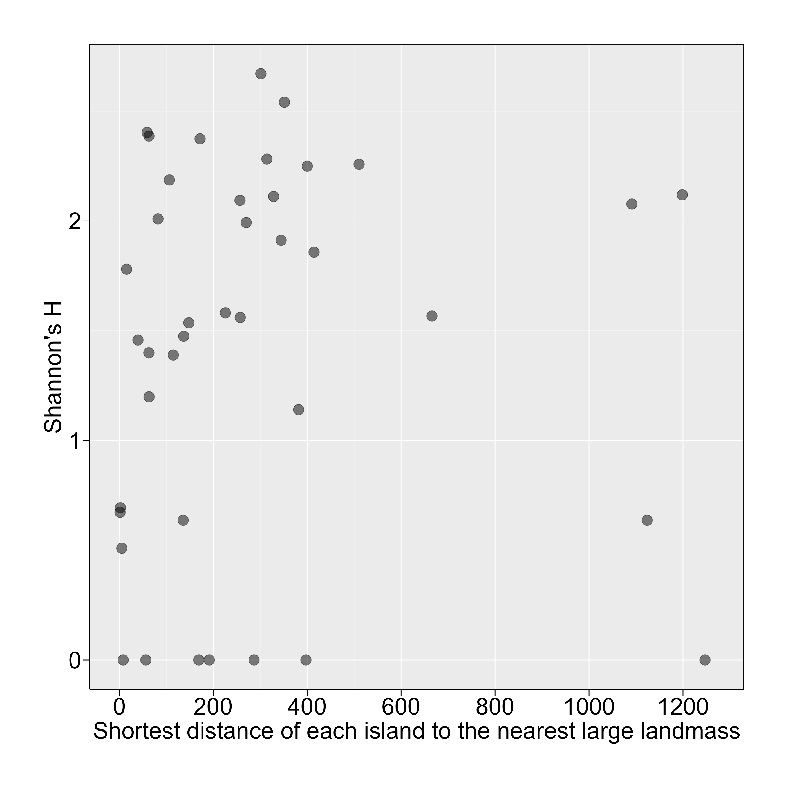


## <strong><font color="#ee827c">発展編②</font>ggplot2を利用した地図の描画（sfパッケージによるGISデータの描画）</strong>

## ggplot2によるGISデータの描画
今回扱っているデータのように、調査地点の座標情報がわかっている場合にはデータ解析の結果を主題図のように地図上に描画することができる

- Q：ただ座標をxy軸に指定したプロットじゃダメなの？
  - A1：汎用性の観点からお勧めできない（ベースマップのデータはGISデータとして提供される）
  - A2：座標値をそのままXY軸にしてプロットするのは妥当ではない（多くの座標情報はWGS84の緯度経度として記録されているため）
※詳しくはGISの教科書を読むか「投影座標系」とかで調べてね

- Q：GISソフトウェア上で描画してはいけない？
  - A：全然かまいません。ただ、GISソフトウェアは基本的にGUI操作で処理を行うので、作業の記録を残す、やり直しをしやすくするという観点からはRの方がよい（と思う）

## sfパッケージでベースマップの読み込み　[***read_sf***](https://r-spatial.github.io/sf/reference/st_read.html)　データフレームのGISデータ化　[***st_as_f***](https://r-spatial.github.io/sf/reference/st_as_sf.html)

`read_sf`関数を用いることで、`.shp`や`.geojeson`で保存されているGISデータをsfオブジェクトとして読み込むことができる。
既存のデータフレームの座標情報を参照してそのデータをsfオブジェクトとしたい場合には、`st_as_sf`関数を用いる。その際には座標系を`crs`に指定する必要があることに注意。

今回はベースマップとして[こちらのページ](https://osmdata.openstreetmap.de/data/land-polygons.html)で提供されているOpenStreetMapの陸域データをクリップしたものを使用した。

```{r sf}
## install.pacages(sf)
library(sf)

basemap <- read_sf("data/basemap_osm.geojson")

island_diversity_sf <- island_diversity %>% 
  separate(island_coordinates, sep = ", ", into = c("LAT", "LON")) %>% 
  mutate(LAT = str_replace(LAT, pattern = ",", replacement = "."), LON = str_replace(LON, pattern = ",", replacement = ".")) %>% 
  mutate(LAT = as.numeric(LAT), LON = as.numeric(LON)) %>% 
  st_as_sf(coords = c("LON", "LAT"), crs = "wgs84")

island_diversity_sf
```


## sfオブジェクトの描画　[***geom_sf***](https://ggplot2.tidyverse.org/reference/ggsf.html)：とりあえずプロット

sfオブジェクトは`geom_sf`関数によってggplot2レイヤーとして描画することができる。この際、座標情報はsfオブジェクトから自動的に呼び出されるため、`aes`内では点やポリゴンの色分けに使う列名等を指定することになる。
また描画範囲は`coord_sf`関数の`xlim`および`ylim`で指定できる。

※今回の場合、`island_property`には多様性指数を算出できない（＝調査記録がない）20島のデータが含まれているため、それらの点は灰色の点となっている。

```{r geom_Sf}
g_gis_raw <- ggplot() + 
  geom_sf(data = basemap, color = "black", fill = "darkolivegreen3") + 
  geom_sf(data = island_diversity_sf, aes(color = Shannon_H), size = 4, alpha = 0.8) + 
  scale_color_viridis_c(name = "Shannon's H", breaks = seq(0, 3, by = 1)) + 
  coord_sf(xlim = c(130.55, 130.60), ylim = c(-0.53, -0.5)) + 
  labs(caption = "Land data from OSM(https://osmdata.openstreetmap.de/data/land-polygons.html)") + 
  theme_example + 
  theme(
    legend.position = c(0.15, 0.20)
  )
ggsave(g_gis_raw, file = "g_gis_raw.png", width = 14, height = 8, dpi = 200)
```

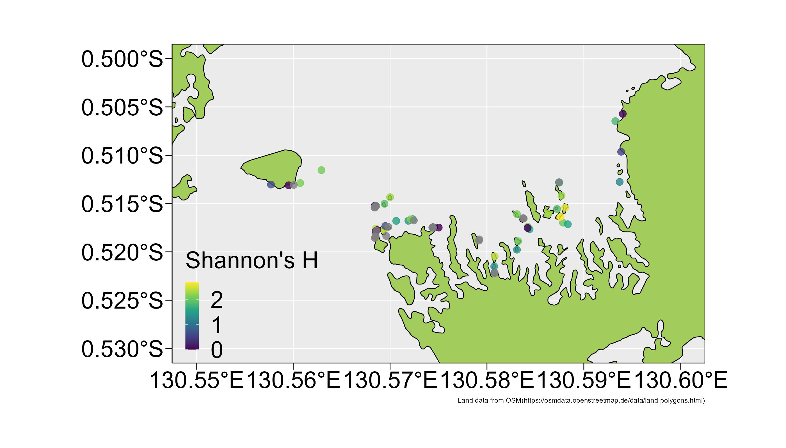


## 投影　[***st_transform***](https://r-spatial.github.io/sf/reference/st_transform.html)　と描画　[***geom_sf***](https://ggplot2.tidyverse.org/reference/ggsf.html)

sfオブジェクトに対して`st_transform`関数を適用することで座標の投影変換を行うことができる。ここでは調査地点の位置を考慮し、「UTM Zone 52S」に投影変換を行っている。
投影返還を行った場合には座標単位が変わるため、`coord_sf`の範囲指定はそれに合わせた値を与える必要がある。ただし、描画時の軸ラベルは緯度経度表示のままとなる。

```{r geom_sf2}
basemap_utm <- basemap %>% 
  st_transform(crs = "+proj=utm +zone=52 +south +datum=WGS84 +units=m +no_defs")

island_diversity_sf_utm <- island_diversity_sf %>% 
  st_transform(crs = "+proj=utm +zone=52 +south +datum=WGS84 +units=m +no_defs")

island_diversity_sf_utm

g_gis_utm <- ggplot() + 
  geom_sf(data = basemap_utm, color = "black", fill = "darkolivegreen3") + 
  geom_sf(data = island_diversity_sf_utm, aes(color = Shannon_H), size = 4, alpha = 0.8) + 
  scale_color_viridis_c(name = "Shannon's H", breaks = seq(0, 3, by = 1)) + 
  coord_sf(xlim = c(673000, 678000), ylim = c(9942000, 9945000)) + 
  labs(caption = "Land data from OSM(https://osmdata.openstreetmap.de/data/land-polygons.html)") + 
  theme_example + 
  theme(
    legend.position = c(0.15, 0.20)
  )
ggsave(g_gis_utm, file = "g_gis_utm.png", width = 14, height = 8, dpi = 200)
```

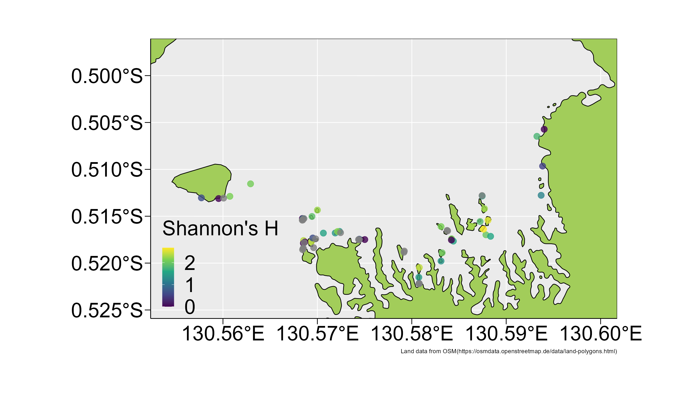


# 最後に…
- 道具は道具に過ぎないから、**目的に則したものを選ぼう**

- もしも困ったことがあったら、
  - とりあえず関数のレファレンスを見よう！
  - 英語で検索しよう！
  - 質問サイト・ページを活用しよう！（Qiita、Slackグループ、StackOverflow）
  
- お役立ちページ
  - [R for Data Science](https://r4ds.had.co.nz/)：Tidyverseの使い方についてちゃんと学ぶことができる教科書
  - [RStudio Cheatsheets](https://www.rstudio.com/resources/cheatsheets/)：各パッケージの関数が図解で解説されていてめちゃくちゃ良い
  
- 連絡先：m.eco.3793（アットマーク）gmail.com

